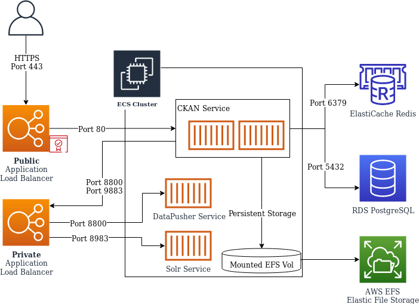

# sba-gov-ckan

https://data.sba.gov is the home of open data at the Small Business Administration.  The platform of choice for hosting this data is called CKAN.  Within this repository, you will find a set of Docker image configurations that make up the services required to run CKAN in a containerized cloud environment.

## Infrastructure Components

Custom Docker Images

* [CKAN](./ckan/README.md)
* [Apache Solr](./ckan-solr/README.md)
* [DataPusher](./ckan-datapusher/README.md)



## Data Migration

CKAN is currently being stood up in a new AWS account. Data will need to be migrated from the old `sba.gov` aws account to the new `ckan` account. In order to migrate data perform the following steps:

1. use `pg_dump` to dump the database to s3

```sh
pg_dump --format=custom -d ckan_default > ckan.dump
aws s3 cp s3://230968663929-us-east-1-ckan-migration/ckan.dump
```

2. Restore the database into the new environment

```sh
pg_restore --clean --if-exists -d ckan_default < ckan.dump
```

3. Copy the assets from s3 to EFS

```sh
aws s3 cp s3://230968663929-us-east-1-ckan-migration/resources/ resources/ --recursive
aws s3 cp s3://230968663929-us-east-1-ckan-migration/storage/ storage/ --recursive
```

4. Connect to the CKAN container and perform a DB upgrade

[documentation](https://docs.ckan.org/en/2.9/maintaining/database-management.html#db-upgrade)

```sh
ckan -c /srv/app/ckan.ini db upgrade
```

5. Reindex search

[documentation](https://docs.ckan.org/en/2.9/maintaining/cli.html#rebuild-search-index)

```sh
ckan -c /srv/app/ckan.ini search-index rebuild
```

## CKAN Plugins

### Plugins

Plugins are not native and require additional installation steps.

- `xloader`: Loads CSV and similar data into CKAN's datastore. Designed to replace DataPusher. [GitHub](https://github.com/ckan/ckanext-xloader).

- `google-analytics`: Puts the google analytics asynchronous tracking code into your page headers. [GitHub](https://github.com/GSA/ckanext-googleanalyticsbasic)

- `s3filestore`: Use Amazon S3 as a filestore for resources. [GitHub](https://github.com/keitaroinc/ckanext-s3filestore)

- `ckanext-dcat_usmetadata`: This extension provides a new dataset form for inventory.data.gov. The form is tailored to managing metadata meeting the DCAT-US Schema [GitHub](https://github.com/GSA/ckanext-dcat_usmetadata)

- `ckanext-datajson`: Plugin datajson provides a harvester to import datasets from other remote /data.json files. See below for setup instructions [GitHub](https://github.com/GSA/ckanext-datajson)

- `ckanext-usmetadata`: expands CKAN to offer a number of custom fields related to the DCAT-US Schema [GitHub](expands CKAN to offer a number of custom fields related to the DCAT-US Schema)

**envvars is now native to CKAN2.10**
- `ckanext-envvars`: This CKAN extension checks for environmental variables conforming to an expected format and updates the corresponding CKAN config settings with its value [GitHub](https://github.com/GSA/ckanext-envvars)

### Native Extensions

Extensions are native and can be enabled by configuring the CKAN config file.

- `datastore`: Provides an ad hoc database for storage of structured data from CKAN resources. Data can be pulled out of resource files and stored in the DataStore. [Documentation](https://docs.ckan.org/en/2.9/maintaining/datastore.html)
- `stats`: Analyzes your CKAN database and displays several tables and graphs with statics about your site. [Documentation](https://docs.ckan.org/en/2.9/maintaining/stats.html)
- `text_view`: Displays files in XML, JSON or plain text based formats with the syntax highlighted. [Documentation](https://docs.ckan.org/en/2.10/maintaining/data-viewer.html#text-view)
- `recline_view`: **Deprecated and should not be used**. Recommends if needed to replace with `React Data Explorer`. [Documentation](https://github.com/datopian/data-explorer)

### Installing Plugins

All dependencies are currently managed in `/ckan/requirements.txt`. If separate installation is required please review the documentation links above or follow the install instructions below.

#### install `google-analytics`

1. install the plugin
```sh
pip install ckanext-googleanalyticsbasic
```

2. add `google_analytics` to `ckan_plugins` in `.env`
```sh
ckan__plugins="datastore datapusher stats text_view recline_view envvars googleanalyticsbasic"
```

#### install `ckanext-dcat_usmetadata`

1. install the plugin
```sh
pip install ckanext-dcat_usmetadata
```

2. add `ckanext-dcat_usmetadata` to `ckan_plugins` in `.env`
```sh
ckan__plugins="datastore datapusher stats text_view recline_view envvars dcat_usmetadata"
```

3. confirm `ckanext-dcat_usmetadata` is installed by running the following command:
```sh
ckan dcat_usmetadata --help
```

#### Install `ckanext-usmetadata`

```sh
pip install ckanext-usmetadata
```

2. Add `ckanext-usmetadata` to `CKAN_PLUGINS` in `.env`
```sh
CKAN__PLUGINS="datastore datapusher stats text_view recline_view envvars usmetadata"
```

3. Confirm `ckanext-dcat_usmetadata` is installed by creating a dataset. The form should have a message at the top stating the following:
```sh
The following fields are required metadata for each dataset in an agency’s inventory (per Section 202 of the OPEN Government Data Act). For more information about the form fields, consult the DCAT-US Schema.
```

#### Install `ckanext-datajson`

```sh
pip install ckanext-datajson
pip -e git+https://github.com/ckan/ckanext-harvest.git@2e5ac42f3ba58dd4bcb1e69a783e155828ff4b89#egg=ckanext-harvest
pip install requirements.txt (contains other packages required for harvest)
```

2. Add `ckanext-datajson` to `CKAN_PLUGINS` in `.env`
```sh
CKAN__PLUGINS="datastore datapusher stats text_view recline_view envvars datajson harvest datajson_harvest datajson_validator"
```

3. Confirm `ckanext-datajson` is installed the endpoint for validation should be accessible at:
```sh
http://domain.com/dcat-us/validator
```

## User Management

The purpose of this section is to demonstrate how user accounts can be created, password can be reset, and if necessary promote a user to sysadmin status using the ckan command line utility from a running container. This section assumes that you are using the docker-compose solution provided and that CKAN services are already running on your local machine or that you have a running AWS Fargate service.


### How to gain access to the running container

Please be sure that the present working directory is the root of this project and the following software has been installed and configured.

- docker
- docker-comose
- awscli
- jq

If you are running CKAN using the provided `docker-compose` solution then you can gain shell access to the running container using the following command.

```
$ docker-compose exec ckan /bin/bash
```

If you are running CKAN as a Fargate service in AWS then you can gain shell accesss to the running container considering the service has the [execute-command](https://registry.terraform.io/providers/hashicorp/aws/latest/docs/resources/ecs_service#enable_execute_command) enabled. At the root of this repository we have crafted a shell script named `fargate-service-list.sh` that will generate the `awscli` command necessary for connecting to a running running service task.

Simply run the script which will prompt for some information:

- Choose an ECS Cluster
- Then choose the ECS Service found on that cluster
- Then choose the ECS task running under the provision of that service

It will then generate a command to copy and paste which will look like the following example:

```
  aws ecs execute-command --interactive --cluster production \
    --task 11223344556677889900 --container ckan --command '/bin/bash'
```


### How to use the ckan command line

Display a list of users.

```
$ ckan user list
```

Creating a new user.

```
# with prompt
$ ckan user add 'username'

# without prompt
$ ckan user add 'username' email='email' password='password'
```

Reset a users password.

```
$ ckan user setpass 'username'
```

Remove a user.

```
$ ckan user remove 'username'
```

Display a list of sysadmin users.

```
$ ckan sysadmin list
```

Promote a user to sysadmin.

```
$ ckan sysadmin add 'username'
```

Demote a sysadmin user.

```
$ ckan sysadmin remove 'username'
```


## Local Development

Requirements are:
1. docker installed
2. docker-compose installed

This solution will also require an entry into your `hosts` file of the following `127.0.0.1 sba.ckan.com` and this file can be found respectivly based on your OS at:

* Windows: `c:\windows\system32\drivers\etc\hosts`
* Linux: `/etc/hosts`

```
# In a Linux setting this is easy!
$ sudo echo "127.0.0.1 sba.ckan.com" >> /etc/hosts
```

**Note:**

To explain why this is necessary please understand that in a production setting the `CKAN_SITE_URL` variable must be able to resolve.  When a dataset is uploaded, CKAN tracks that file in **Solr** as a fully qualified URI which triggers a **DataPusher** job to process that file.  If the URI cannot resolve then the **DataPusher** job will fail and the `preview` option of that dataset in the browser will be unavailable.

This docker-compose solution uses a custom `bridge` network where each service is assigned a static IPv4 address.  This way we can use the `extra_hosts` option of the **DataPusher** service to map `sba.ckan.com` to the static IPv4 address assigned to **CKAN** allowing it to resolve both on your local machine and by the **DataPusher** virtual machine.


### Using docker-compose to run the solution locally **CKAN2.10**

* Open a command line shell
* Run `docker-compose build` to build all images in the solution
* Run `docker-compose up` once the images have been built
* Wait for services to come online, and the databases to be initialized
* Interface with the following service via a web browser:
  * CKAN @ [http://sba.ckan.com](http://sba.ckan.com)
  * FakeEmail @ [http://sba.ckan.com:1080](http://sba.ckan.com:1080)
  * Solr @ [http://sba.ckan.com:8983](http://sba.ckan.com:8983)
* Open another command line shell
* Run `docker-compose -f docker-compose.sysadmin.yaml run --rm sysadmin` to create the ckanadmin user
* Login to CKAN using `ckanadmin` as both the username and password
* Login to FakeEmail using `fake` as both the username and passowrd
* Enjoy!

### Using docker-compose to stop and cleanup locally

* Open a command line shell
* Run:
  * `docker-compose down` to remove all contaienrs and networks
  * `docker-compose down -v` to remove all containers, volumes, and networks
  * `docker-compose down -v --rmi all` to remove all containers, volumes, and networks and images

### Using docker-compose to stop and cleanup locally

* Open a command line shell
* Run:
  * `docker compose -f docker-compose-new.yaml down` to remove all containers and networks
  * `docker-compose -f docker-compose-new.yaml down -v` to remove all containers, volumes, and networks
  * `docker-compose -f docker-compose-new.yaml down -v --rmi all` to remove all containers, volumes, and networks and images

## Build and Deployment Pipeline

This project is built with CircleCI and has the configuration [in this repository](./.circleci/config.yml).

### Feature Branch

When a new branch is pushed to GitHub, circleci will:

1) Tests the docker builds
1) Runs a terraform fmt
1) Run a [snyk](https://www.snyk.io) scan on the built image

### Master Branch

No jobs besides the `feature branch` jobs run without a tag. On a Staging or Production tag push the following jobs run:

1) ckan-solr-build-push
1) ckan-datapusher-build-push
1) ckan-build-push
1) test-terraform-plan
1) deploy-services-${env}

To trigger a tag based deployment please see the instructions below.

### Tag based deployment

To trigger a build/deploy workflow for a specific environment, the following git tags can be used for their respective environments:

* Staging -> `rc-vX.X.X`
* Production -> `vX.X.X`

Staging Example:
```sh
git tag rc-v1.0.0 && git push origin rc-v1.0.0
```

Production Example:
```sh
git tag v1.0.0 && git push origin v1.0.0
```

## Contributing

We welcome contributions.
To contribute please read our [CONTRIBUTING](CONTRIBUTING.md) document.

<sub>All contributions are subject to the license and in no way imply compensation for contributions.</sub>


## Code of Conduct
We strive for a welcoming and inclusive environment for all SBA projects.

Please follow this guidelines in all interactions:

* Be Respectful: use welcoming and inclusive language.
* Assume best intentions: seek to understand other's opinions.

## Security Issues

Please do not submit an issue on GitHub for a security vulnerability.
Instead, contact the development team through [HQVulnerabilityManagement](mailto:HQVulnerabilityManagement@sba.gov).
Be sure to include **all** pertinent information.

<sub>The agency reserves the right to change this policy at any time.</sub>
